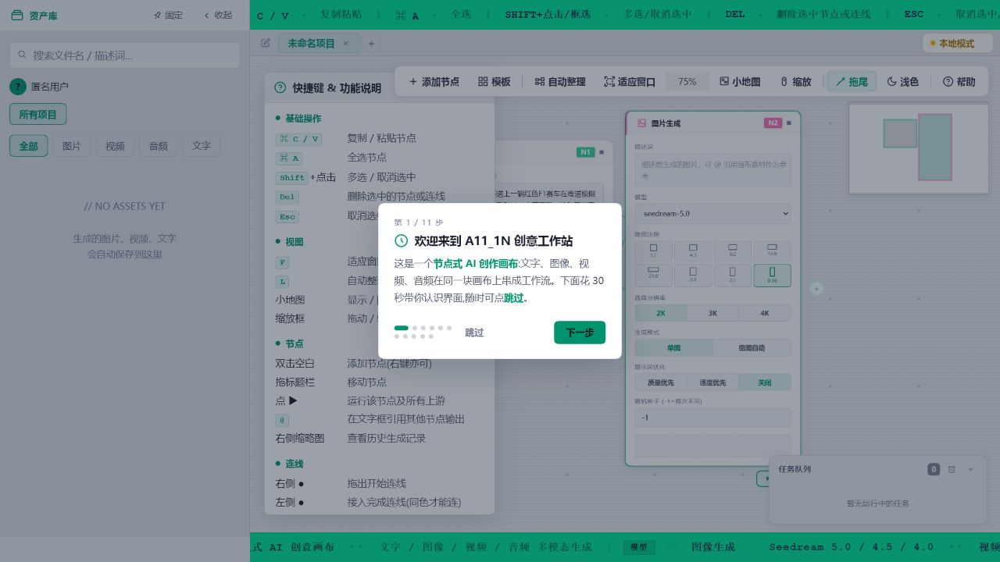
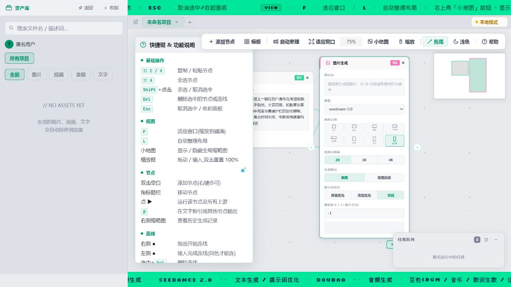
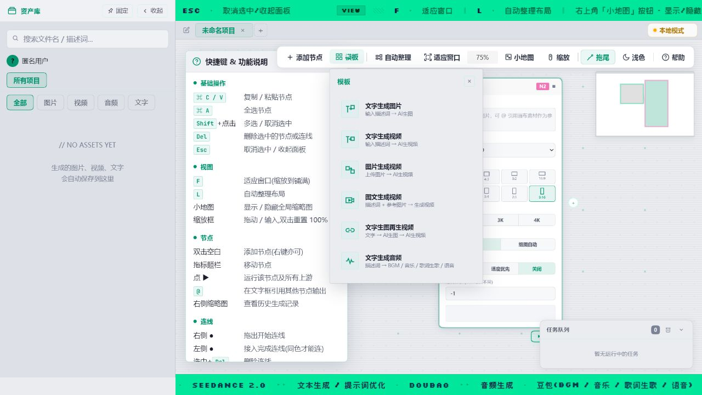

# A11in AI 创意画布

基于 moxt.ai 制作的节点式多模态 AI 创作画布。通过可视化连线，将文字、图片、视频和音频节点组合成可复用的内容生产工作流。



## 主要能力

- 无限画布、节点连线、缩放、小地图和自动布局
- 文字输入、图片/视频/音频上传与生成节点
- Seedream 图片生成、Seedance 视频生成和豆包音频生成
- 工作流模板、项目管理、素材预览和本地持久化
- moxt.ai 环境下的团队资产、广场、回收站和在线协作

## 快速开始

这是一个纯静态 Web 应用，无需构建。克隆仓库后，在项目目录启动任意静态服务器：

```powershell
git clone https://github.com/wyucn/A111n.git
cd A111n
npx --yes serve@14.2.5 .
```

根据终端提示打开本地地址，再访问 `main.html`。如果电脑已安装 Python，也可以运行：

```powershell
python -m http.server 8080
```

然后打开 `http://localhost:8080/main.html`。未配置第三方服务时，画布、节点编辑、模板和本地项目功能仍可使用；点击 AI 生成时会提示缺少对应配置。

> 不建议直接双击 `main.html`。浏览器对 `file://` 页面有额外安全限制，静态服务器下的行为更稳定。

## 3 分钟完成第一个工作流

1. 首次打开后按新手引导认识画布，也可以点右上角 **帮助** 随时重看。
2. 从左侧节点库添加 **文字输入**，输入想生成的画面描述。
3. 添加 **图片生成** 节点，从文字节点右侧端口拖线到图片节点左侧同色端口。
4. 在图片节点选择模型、画幅、分辨率和提示词优化方式。
5. 点击节点底部 **运行**。配置正确时，结果会显示在节点中并进入左侧资产库。



不想从空白画布开始时，点击顶部 **模板**，可快速创建文生图、文生视频、图生视频、图文生视频、文生图再生视频或文生音频工作流。



## 配置 AI 生成能力

公开仓库不包含真实密钥、账号、专用模型 Endpoint 或 webhook。按下面步骤配置你自己的服务：

1. 复制配置模板：

   ```powershell
   Copy-Item config.example.js config.local.js
   ```

2. 编辑 `config.local.js`，只填写实际使用的服务。常用字段如下：

   | 字段 | 用途 |
   | --- | --- |
   | `arkApiKey` | 火山方舟 API Key |
   | `arkModels.text` | 文本生成/提示词优化模型 Endpoint ID |
   | `arkModels.image40/45/50` | 对应 Seedream 图片模型 Endpoint ID |
   | `cozeToken` | Coze 音频工作流 Token |
   | `cozeMusicUrl` / `cozeVoiceUrl` | 音乐与语音工作流地址 |
   | `persistWebhookUrl` | 可选的资产持久化 webhook |

3. 将 `main.html` 中引入的 `config.js` 临时改为 `config.local.js`，然后刷新页面。部署时建议由私有部署流程注入配置。

`config.local.js` 已被 Git 忽略，请勿强制提交。浏览器前端无法真正隐藏密钥；公开或生产部署必须通过自己的后端代理调用第三方 API，并限制来源、权限和额度。

## 常用操作

| 操作 | 方法 |
| --- | --- |
| 添加节点 | 左侧节点库、双击画布空白处，或点击顶部“添加节点” |
| 移动画布 | `Space` + 拖拽，或按住鼠标中键拖拽 |
| 连线 | 从节点右侧输出端口拖到目标节点左侧同色端口 |
| 删除 | 选中节点或连线后按 `Delete` / `Backspace` |
| 复制/粘贴 | `Ctrl + C` / `Ctrl + V` |
| 编组/解组 | `Ctrl + G` / `Ctrl + Shift + G` |
| 运行编组 | 选中编组后按 `R` |
| 自动布局 | 按 `L` 或点击顶部“自动整理” |
| 适应窗口 | 按 `F` 或点击顶部“适应窗口” |
| 引用素材 | 在提示词中输入 `@`，选择其他节点输出 |

端口按数据类型区分颜色，只有兼容的端口可以连接：文本为青色、图片为粉色、视频为橙色、音频为紫色。

## 数据与兼容性

- 本地项目和资产主要保存在浏览器存储中；清理站点数据前请先备份重要内容。
- moxt.ai 团队资产、跨设备同步、在线用户等能力依赖其宿主环境，在普通本地静态服务器中会降级为本地模式。
- 推荐使用最新版 Chrome、Edge 或其他 Chromium 内核浏览器。

## 安全说明

公开版本已移除原开发环境中的 API Key、Token、企业账号、管理员白名单、专用模型 Endpoint、插件地址和 webhook。若曾在其他版本或提交中暴露过密钥，请同时在服务提供方撤销并轮换；仅从代码中删除并不能使旧密钥失效。
